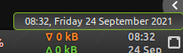

# fastis

This is a simple script in bash. It is a calendar applet for the Ciinamon Desktop Environment. 
It shows data in a more compact way (two rows), thus being more economical as far as the panel real estate is concerned.
It works with the RunCommand Applet, for Linux Mint Cinnamon Desktop Environment.

On hover over the applet, this tooltip is shown:

Clicking on the panel applet opens gnome-calendar.

## INSTRUCTIONS

-  Change Directory to fastis

`$ cd fastis`

-  Make this file executable with the following command in terminal:

`chmod +x fastis.sh`

* Make sure you download the **CommandRunner Applet** in cinnamon panel:

 * Right click on the panel you want to present the network monitor

 * Select **Applets**

 * Select **Download** tab, select **CommandRunner** and download it

 * Back on the **Manage** tab, press the CommandRunner **Configure** button.

 * In the **Command** field, put : /homer/user'sname/path-to-directory/fastis/fastis.sh
 * In the **Run Interval** field, put: 1 second
 * Hit **Apply**
 * You are good to go.

